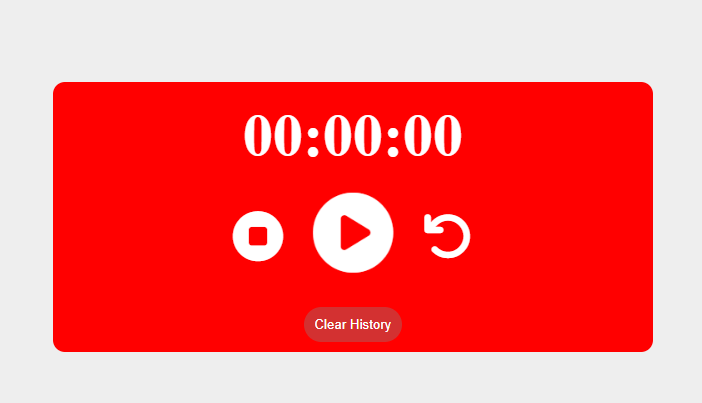

# ⏱️ Simple Stop Watch Website

A clean, precise, and responsive digital stopwatch web application built using fundamental front-end web technologies. 

---

## 🔗 Live Demo

Experience the application live in your browser:
🚀 **[View Live Demo](https://mohab-elhashem.github.io/Stop-Watch/)**

---

## 📸 Preview

---

## 🚀 Features

* **Time Tracking:** Accurately counts hours, minutes, seconds, and milliseconds.
* **Control Buttons:** Fully functional Start, Pause, and Reset features.
* **Responsive Layout:** Clean design that adapts beautifully to mobile, tablet, and desktop screens.

---

## 🛠️ Technologies & Skills Used

### 1. HTML5 & CSS3
* **Structure:** Crafted a semantic and organized layout for the timer display and control buttons.
* **Styling:** Applied a modern user interface design with centered positioning, distinct button styles, and smooth hover transitions.

### 2. JavaScript (Vanilla JS) & DOM Manipulation
Implemented core programming logic and timing events to bring the stopwatch to life:
* **DOM Manipulation:** Accessed and dynamic updated the timer text inside the HTML elements in real-time.
* **`Functions`:** Created modular functions to handle the logic for starting, pausing, updating, and resetting the time calculations.
* **`addEventListener`:** Attached click events to the control buttons to trigger the appropriate stopwatch actions instantly.
* **Timing Methods:** Utilized JavaScript's built-in timing methods to handle accurate time updates.
